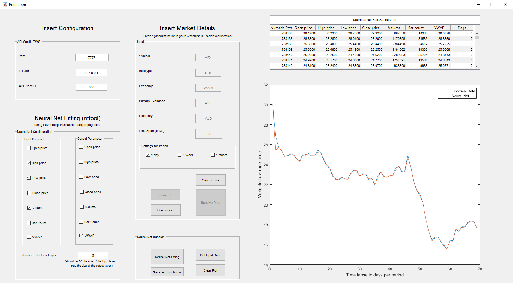

  <h3 align="center">Historical Data Management and Configuration for a Neural Net Fitting Process </h3>

<!-- PROJECT LOGO -->
 

  

  <h3 align="center">GUI for testing Connection and Save and manage Datasheets</h3>

  

    TWS API for a simple request and managing of historical Stock Information
     
    <a href="https://github.com/ecschuetz/TWS-API-Historical-Data-Manager"><strong>Explore the docs »</strong></a>
     
     
    <a href="https://github.com/ecschuetz/TWS-API-Historical-Data-Manager">View Demo</a>
    ·
    <a href="https://github.com/ecschuetz/TWS-API-Historical-Data-Manager/issues">Report Bug</a>
    ·
    <a href="https://github.com/ecschuetz/TWS-API-Historical-Data-Manager/issues">Request Feature</a>
  

<!-- ABOUT THE PROJECT -->
## About The Project

Neural Net Fitting of given historical Market Data. 
v.1.0 receives historical information. The Given Arguments can be choosen for Input or Output values
the command history(ib,ibContract,f) includess: 

- Numeric representation of a date

- Open price

- High price

- Low price

- Close price

- Volume

- Bar count

- Weighted average price

- Flag indicating if there are gaps in the bar

<!-- GETTING STARTED -->
## Getting Started
Make Sure you have the latest TWS API see: https://interactivebrokers.github.io
If you have a MATLAB license, just get all .m and the .fig files and Run Programm.m
If you dont have MATLAB, install the .exe file in the Excecutable folder

If you are able to Run the GUI, make sure youre Trader Workstation is set up correctly with input arguments you choose in the GUI

### How it works

click connect to make to run the given arguments from the API-Config TWS Panel and the Input Panel
Run Receive Data button to get the historical Data
Select Input and Output arguments to build your own neural Network with nftool (click the Neural Net Fitting button)
Save the historical Data by clicking Save to .xls. The Sheet will be located where the Programm.m or .exe is located
Click Disconnect to make the next Analyse

